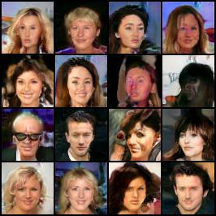

# Deep learning project - StyleGAN2

This is the source code for a project at course Deep Learning, regarding the re-implementation and testing of [StyleGAN2 paper](https://arxiv.org/abs/1912.04958), "Analyzing and Improving the Image Quality of StyleGAN". The implementation is done using PyTorch.

The goal is to first implement, train and evaluate StyleGAN2, using the popular [FID metric](https://github.com/mseitzer/pytorch-fid). Then, the idea (hope) is to implement the improvement of StyleGAN2 - [StyleGAN2-ADA](https://arxiv.org/pdf/2006.06676.pdf).

## Note

If you intend to run anything from this repository, make sure the path to the directory where you cloned it is added to `PYTHONPATH`, if you are on Windows. It seems to work fine without that on Linux.


# Repository structure

A brief overview of the structure of the repository:

```
./
├── celeba/                         # Dataset. Download instructions below
│   └── img_align_celeba
│       ├── 000001.jpg
│       ├── 000002.jpg
│       ├── 000003.jpg
│       └── ...
│
├── discriminator_utils/            # Discriminator layers
│   ├── discriminator_block.py      # Residual discriminator block (2 3x3 conv layers, residual 1x1 conv)
│   └── from_rgb.py                 # FromRGB layer
│
├── general_utils/                  # General utility functions
│   ├── equalized.py                # Linear and convolution layers with equalized learning rate
│   ├── generator_noise.py          # Function that generates the noise input for each generator block
│   ├── logger.py                   # Function for setting up a logger
│   ├── losses.py                   # Non-saturating logistic loss (original GAN), R1 and path length regularizations
│   ├── proxy.py                    # Proxy function that shows hints when invoking the forward function of a nn.Module
│   └── upsample.py                 # Upsampling and downsampling operations using FIR filter smoothing
│
├── generator_utils/                # Generator layers
│   ├── generator_block.py          # Skip generator block (2 3x3 convs with weight demodulation, ToRGB)
│   └── to_rgb.py                   # ToRGB layer
│
├── model/
│   ├── dataset.py                  # Function to return train (and optional test) DataLoader
│   ├── discriminator.py            # Discriminator put together
│   ├── generator.py                # Generator put together
│   ├── mapping_network.py          # Mapping network + truncation trick
│   └── model.py                    # Put entire model together, hyperparameters, train loop, checkpoints, ...
│
├── continue_training.py            # Continue training from a pretrained model
├── generate.py                     # Generate images using a pretrained model for evaluating FID
├── prepare_celeba.py               # Resize test CelebA images to 64x64 for evaluating FID
└── run_training.py                 # Train a model from scratch. Uses CUDA automatically if available.
```

I tried to partition the repository, and the code itself, as neatly as possible. If you happen to be reading this, and have any suggestions on how the code/structure could be improved, do let me know.

If you're wondering why `prepare_celeba.py` resizes CelebA images from the test split to 64x64 - it's because the models I trained only go up to 64x64 resolution, so I wanted an "even playing field" when evaluating FID.


# CelebA dataset

The dataset used is CelebA, which is [available in PyTorch](https://pytorch.org/vision/main/generated/torchvision.datasets.CelebA.html). However, if you try to download it by setting `download=True`, you may (and most probably will) get a `RuntimeError: The daily quota of the file img_align_celeba.zip is exceeded and it can't be downloaded. This is a limitation of Google Drive and can only be overcome by trying again later.`

To avoid having to wait, I suggest going to the [official Google Drive for CelebA](https://drive.google.com/drive/folders/0B7EVK8r0v71pWEZsZE9oNnFzTm8?resourcekey=0-5BR16BdXnb8hVj6CNHKzLg), and downloading the following 6 files:
- From **Img**
  - img_align_celeba.zip
- From **Eval**
  - list_eval_partition.txt
- From **Anno**
  - list_landmarks_align_celeba.txt
  - list_bbox_celeba.txt
  - list_attr_celeba.txt
  - identity_CelebA.txt

Place all of them inside the folder `celeba`, following the repository structure. Then, simply let PyTorch and `model/dataset.py` do the rest.


# Training

All of the models I tested used the following hyperparameters:
```python
num_training_images         = 70000         # Number of CelebA training images
batch_size                  = 32            # Batch size
dim_latent                  = 512           # Dimensionality of latent variables `z` and `w`
adam_betas                  = (0.0, 0.99)   # Betas for Adam optimizer
gamma                       = 10            # Gradient penalty coefficient gamma
use_loss_regularization     = True          # Use R1 (gradient penalty) and path length regularization
checkpoint_interval         = 1000          # How often to save a checkpoint
generate_progress_images    = True          # Whether to also generate some images every `checkpoint_interval` steps
```

The one model that worked used `gan_lr = 0.002` (learning rate for generator and discriminator), `mapping_network_lr = 0.0002` (learning rate for the mapping network), and `gradient_accumulate_steps = 4` (how many steps to accumulate gradients for). It was trained for 10000 steps. It is available on [this OneDrive link](https://unilj-my.sharepoint.com/:f:/g/personal/lb7093_student_uni-lj_si/EtsXQKILSytMjCp5mm3rBwIBUuDM5eyozsyBKpn6ILq_2A?e=lAj8GU), with the name `stylegan2-3idx-10000steps.pth`, if you want to download it.

By "worked", I mean that the model didn't experience [mode collapse](https://github.com/lucidrains/stylegan2-pytorch/issues/183) and was able to generate images of something that (at least at 10000 steps) resembles a face. Here's an example of a 4x4 grid generated by that model.


I tried using the [truncation trick](https://github.com/NVlabs/stylegan3/issues/76) introduced back in StyleGAN, but I'm not really sure if it helped. The above generated image was with `truncation_psi=0`. The implementation of it could be wrong, or (more likely) I'm missing something else. [This](https://www.youtube.com/watch?v=T-ATofqmoUY) is how truncation should look like.


## FID score

For evaluating [FID](https://github.com/mseitzer/pytorch-fid), I first took the test split of the CelebA dataset (19962 images) and resized them all to 64x64. This can be done with `prepare_celeba.py` script. The resized images are placed in `celeba_test_64x64` by default.

Then, with `generate.py`, I generated the same amount of images using the aforementioned trained model, namely `stylegan2-3idx-10000steps.pth`. The generated images will be placed under `generated_3idx_10000steps` by default.

The model managed to achieve a FID score of 38.365, which isn't necessarily the greatest result, but it's not all that terrible.

I also tried training the model for an additional 10000 steps (`stylegan2-3idx-20000steps.pth` in the aforementioned OneDrive link). I repeated the same procedure, and that model managed to achieve a FID score of 23.937, which is a rather significant improvement. Here's an example of a 4x4 grid generated by that model. The faces are a slightly clearer than the less trained model.




## What didn't work

Hyperparameters that didn't work (all of these models experienced mode collapse):
- `gan_lr = 0.001`, `mapping_network_lr = 0.0001`, `gradient_accumulate_steps = 1`
- `gan_lr = 0.001`, `mapping_network_lr = 0.001`, `gradient_accumulate_steps = 4`
- `gan_lr = 0.0001`, `mapping_network_lr = 0.0001`, `gradient_accumulate_steps = 4`
- `gan_lr = 0.0002`, `mapping_network_lr = 0.0002`, `gradient_accumulate_steps = 1`
- `gan_lr = 0.002`, `mapping_network_lr = 0.0002`, `gradient_accumulate_steps = 1` - this one didn't mode collapse as bad as others but it still did 
- `gan_lr = 0.0002`, `mapping_network_lr = 0.0002`, `gradient_accumulate_steps = 4`
- `gan_lr = 0.002`, `mapping_network_lr = 0.0002`, `gradient_accumulate_steps = 8`
- `gan_lr = 0.002`, `mapping_network_lr = 0.0002`, `gradient_accumulate_steps = 4`, `adam_betas = (0.5, 0.99)`


# Disclaimer

To anyone viewing this repository, I should note that this was my first experience with GANs in general, so I advise taking the hyperparameters and the training loop with a slight grain of salt, as training GANs is (as I have experienced) quite a difficult task. There are certainly areas where improvements are possible. 

However, I should also point out that I invested a lot of effort browsing through 5 different repositories regarding StyleGAN(2, 2-ADA) implementations, and reading through the StyleGAN papers trying to at the very least match the structure of all individual layers. I *think* the structure is for the most part okay, but again, this was my first time working with anything related to GANs, so there may be some errors or oversights.